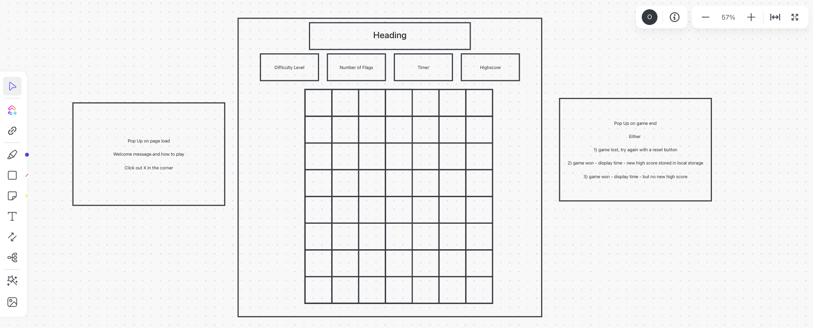
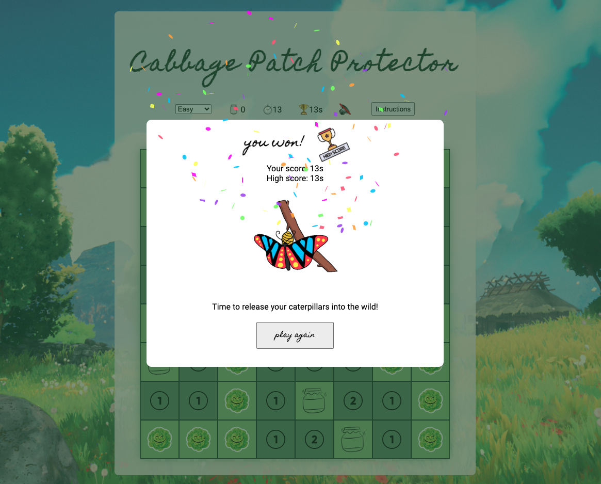

# Cabbage Patch Protector

**A JavaScript grid game based on the principles of minesweeper.**

[Cabbage Patch Protector](https://livdarby.github.io/SEB-Project-1/) is a single-player game, featuring a grid of clickable tiles, with hidden catterpillars randomly placed throughout the grid. The goal is to identify the location of each caterpillar using the numbers revealed by "safe" tiles when they are clicked.

Cabbage Patch Protector uses the same logic priniciples as the original Minesweeper game.

## Installation Instruction

To download and edit the game on your local machine:

```
git clone git@github.com:livdarby/SEB-Project-1.git
```

## Technologies Used

**HTML**

- Header and navigation bar
- Audio elements for background, win and lose sound effects
- Instructions, win and lose overlays

**CSS**

- Flex box containers for grid wrapper and navigation bar
- Shake animation for new high score icon
- Grid class styling

**Javascript**

- setInterval to begin the game and update the timer
- Mute and unmute audio button
- addEventListener to hide and reveal the instructions overlay
- Clear and re-add grid depending on the selected difficulty level
- localStorage to compare and update high scores

## Project Roadmap

- Day One: 1. Wireframe the HTML and CSS
   2. Pseudocode

- Day Two:

  1. Build the grid using JavaScript
  2. Randomly distribute 10 mines and add classList "mine"

  ```
  function mineDistribution() {
  while (mineLocations.length < numberOfMines) {
  let num = Math.floor(Math.random() * (cellCount - 1));
  if (num === firstMoveIndex || mineLocations.includes(cells[num])) {
    mineDistribution();
  } else {
    mineLocations.push(cells[num]);
  }
  }
  mineLocations.map((cell) => cell.classList.add("mine"));
  }
  ```

  3. setInterval and update the timer display each second

- Day Three:
  1. Calculate the number of bordering mines for each tile that is clicked on, adding the corresponding classList. Additional if conditions required for fringe tiles to avoid errors.
  2. Recursively check all bordering tiles if a blank tile is clicked on, using a "checked" classList to avoid infinite loops.
  ```
  if (borderingCellsContainingMines.length === 0) {
  cells[playerClickIndex].classList.add("zero");
  borderingIndexes.forEach((index) => {
    const cell = cells[index];
    if (!cell.classList.contains("checked")) {
      cell.classList.add("checked");
      playerClickIndex = index;
      numberofBorderingMines({ target: cell });
    }
  });
  } else if (borderingCellsContainingMines.length === 1) {
  cells[playerClickIndex].classList.add("one");
  } else if (borderingCellsContainingMines.length === 2) {
  cells[playerClickIndex].classList.add("two");
  } else if (borderingCellsContainingMines.length === 3) {
  cells[playerClickIndex].classList.add("three");
  } else if (borderingCellsContainingMines.length === 4) {
  cells[playerClickIndex].classList.add("four");
  } else if (borderingCellsContainingMines.length === 5) {
  cells[playerClickIndex].classList.add("five");
  }
  ```
  3. Enable player to place a "flag" when right-clicking on a tile.

* Day Four:

  1. Update styling with the cabbage and caterpillar theme
  2. Implement win and lose conditions, show and hide overlays
  3. Add reset button and clearInterval

* Day Five:
  1. Stretch Goal 1: play and mute audio
  2. Stretch Goal 2: make game playable in three difficulty levels
  3. Stretch Goal 3: Add CSS animation to the new highscore icon
     

## Challenges & Learnings

1. **Recursive function** to reiterate through the mineDistribution() function if the cell already has a mine (caterpillar) or if the cell was the player's first click.
2. **Style display property** to hide and show the overlays only when the win or loss conditions are met, or the Instructions button is clicked.
3. Opening up the grid when the player clicks a cell with no bordering mines (caterpillars). I solved this challenge by iterating over each bordering cell, until a mine (caterpillar) is located, marking each cell as checked along the way.
4. **Canvas graphics** for the new highscore confetti animation.
